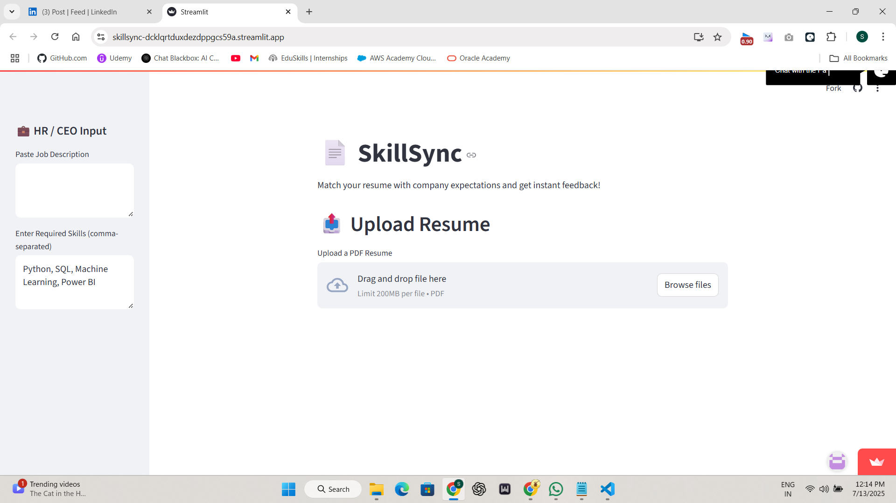
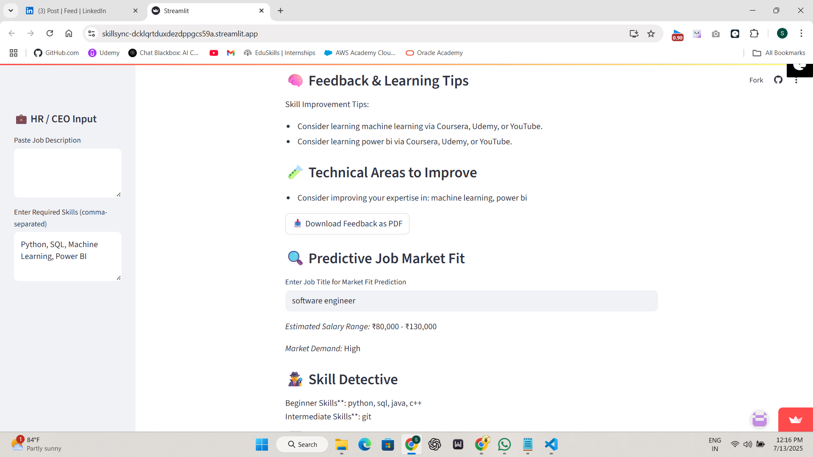

# 🔍 SkillSync – AI Resume Matcher with NLP & Streamlit

**SkillSync** is an AI-powered resume analyzer that helps candidates match their resumes with job descriptions and get detailed feedback and improvement suggestions — instantly.

## 🚀 Features
- 📄 PDF Resume Parser using PyMuPDF
- 🎯 Skill Matching using Cosine Similarity
- 📊 Match Score, Missing Skills, Feedback Report
- 📈 Visual Analytics (Pie Charts, Tables)
- 🧠 Skill Proficiency Detection
- 📥 Downloadable PDF Feedback Report
- 🛠 Built with: Python, NLP, Streamlit, Scikit-learn, Pandas, Matplotlib

## 🧠 Tech Stack
- Python
- Streamlit
- Scikit-learn
- Pandas
- PyMuPDF
- FPDF
- Matplotlib
- Regex

## 📸 Project Screenshots

### 🏁 Interface - Welcome Page


### 📤 Upload Resume Page


### 📋 Resume Content Extraction


### ✅ Skill Match & Feedback


### 🧠 Technical Suggestions


### 📊 Data Analytics Dashboard


```python
streamlit run app.py
```

## 📦 How to Run

```bash
git clone https://github.com/vangasaichandra7/SkillSync.git
cd SkillSync
pip install -r requirements.txt
streamlit run app.py
```

## 💡 Future Improvements
- Upload job descriptions as PDF
- More advanced NLP (NER, keyword ranking)
- Live integration with LinkedIn Jobs API

## 🤝 Author
**Vanga Sai Chandra**  
🎓 B.Tech CSE | Kamala Institute of Technology & Science  
📧 vangasaichandra7@gmail.com  
📍 Hyderabad, India

---

### 🌐 Live Demo
*Coming Soon via Streamlit Cloud*
